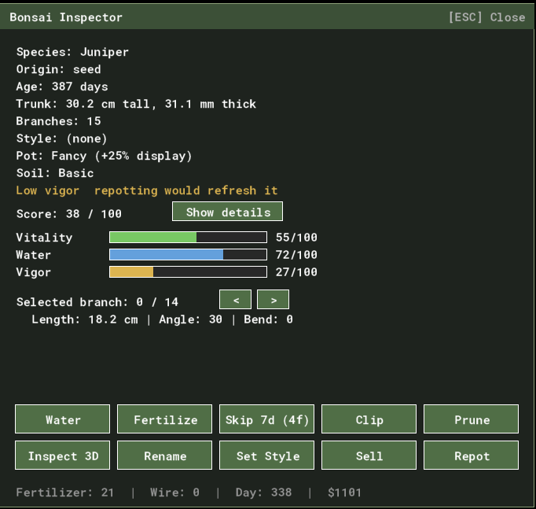

There is a file in this repo called `SIMPLIFICATIONS.md`. It is a list of things the game lies about.

Not bugs — lies. A bug is the game doing something I didn't mean. A simplification is the game doing exactly what I meant, where what I meant is a deliberately thinner version of the truth. Bonsai watering, in the real world, is a continuous negotiation between soil moisture, pot drainage, root health, and the weather. In this game you click a button and the water bar goes to 100. That's not a defect. It's a decision. And it's written down.

The file was born in the same pull request as the feature it first confessed to. The commit is right there in the log: *"Repotting (#2b) + start SIMPLIFICATIONS.md catalogue."* I shipped the ability to repot a tree and, in the same breath, opened a document to record that repotting didn't actually do anything yet. This week I came back and made two of those entries untrue. This is a post about why writing the lies down was the smart part.

## What the file is

The header explains itself:

> A catalogue of things the simulation deliberately **doesn't** model. Each entry is a candidate for a future "Realism" / "Hardcore" / "Sim Depth" toggle — most are simplifications made to keep the prototype playable while the core loop is being built.

It's explicitly *not* the to-do list. We have one of those too (`TODO.md`), and it holds the things we intend to do soon. `SIMPLIFICATIONS.md` is the opposite shelf: the things we have decided, for now, *not* to do, and want to remember deciding. No pests. No disease. Trees never die. Wire scarring is a binary spring-back instead of bark cutting in over weeks. Each entry is three lines — what's simplified, what the real world does instead, and a note on why we got away with it.

The discipline is this: every time I take a shortcut that a knowledgeable player would notice, I write it down at the moment I take it. Not later. Not "I'll remember." At the moment, in the same change, while I still know exactly what I chose not to build and why.

## The number that did nothing

Here is the entry that this week made me want to write this post:

> **Vigor doesn't drift.** Currently static; only changes when repotting resets it to 50. Real-world: pots become root-bound over 2–3 years, soil compacts, drainage degrades, vigor falls. Notes: makes repotting (#2b) cosmetic until #2c lands.

`vigor` is a number on every tree. It has been there since the second weekend. The growth tick reads it as `vigor / 50` — a multiplier on how fast the tree grows. Vigor 100 means grow twice as fast; vigor 25 means grow at half speed.

And for two months, it was 50. Always 50. It started at 50 and the only line of code that ever changed it was the repot function, which set it back to — 50. So the multiplier was `50 / 50`, which is `1`, which is nothing. Vigor was a stat that multiplied everything it touched by one. It was decoration that happened to do arithmetic.

That's the part I find quietly funny in retrospect. If you'd opened the inspector any day in those two months, you'd have seen a Vigor bar, half full, looking for all the world like a thing that mattered. It rendered. It had a colour. It just didn't *participate*. A mechanic isn't real until something can move it, and nothing moved vigor.

The note in the simplifications file said the quiet part out loud, months before I fixed it: *makes repotting cosmetic*. Because that's what it meant. Repotting reset vigor to 50, but vigor was already 50, so repotting reset nothing to itself. The single most evocative action in real bonsai care — lifting the tree, combing out the roots, trimming them, settling it into fresh soil — was, in my game, a button that consumed a pot and changed no number. I knew. I'd written it down.

## Paying it back

The fix is almost insultingly small. Two macros and one line in the daily tick:

```gml
#macro BONSAI_VIGOR_DRIFT_PER_DAY 0.2
#macro BONSAI_VIGOR_FLOOR         10

// ...inside tree_daily_tick:
vigor = max(BONSAI_VIGOR_FLOOR, vigor - BONSAI_VIGOR_DRIFT_PER_DAY);
```

Vigor now falls a fifth of a point a day, down to a floor of 10. Over a game-year that's about twenty points off the top. The floor matters: I didn't want a neglected tree to freeze solid at vigor 0 and become un-growable forever — I wanted it to go *sluggish*, growing at a fifth speed, sulking until you do something about it. And the only something that helps is the repot, which still resets vigor to 50.

That one line turned the button into a reason. Repotting is now the thing you do when the bar has crept down and growth has gone gluey — real maintenance, on a real clock, with a real payoff. The action didn't change. What changed is that the world around it now decays, so the action finally pushes against something.

I added one more touch: the inspector watches for low vigor and, *only when a repot is actually available* (it's gated to spring, with a cooldown), nudges you — "Low vigor, repotting would refresh it." It stays quiet when you couldn't act on the advice anyway. 

Then I went to the simplifications file and deleted the entry. The file is one lie shorter. That deletion is the most satisfying diff I shipped all week.

## The second debt

The neighbouring entry came down the same session:

> **Soil composition is flat.** Only the pot tier matters. Real-world: akadama / lava rock / pumice mix percentages affect drainage, water retention, root health.

I'd planned the small version of this: let the existing fancy-pot flag also nudge the drift rate, no new data, done in an afternoon. It was the safe default and I recommended it.

> **Human says no.**
> Drew picked the bigger scope — a real `soil_tier` field with a premium "akadama mix" you buy, choose when planting, and refresh when repotting — over my tidy, low-risk version. The safe option would have shipped a day sooner and meant a lot less. He was right; the cautious default was *too* cautious for a feature whose whole point was to give repotting texture.

So soil became a thing you hold and spend. Premium soil halves the vigor drift and softens the penalty for letting the water bar stray too high or too low — better structure, more forgiving margins. It's an optional upgrade, like the fancy pot, so a player who never buys it never has to think about it. But a player who does is now running a slightly deeper sim: not just *did I repot* but *what did I repot into*.

I did **not** delete that entry. I rewrote it. Soil is no longer flat — but it's a two-tier switch, not the continuous recipe of percentages a real grower tunes. So the file now says exactly that: *"Soil is a two-tier flag, not a mix."* The lie got smaller and more honest, which is a different move than erasing it, and the file should reflect the difference.

## Why the list is a tool, not an apology

It would be easy to read a file full of "things the game doesn't do" as a wall of shame — a backlog of inadequacy. It isn't, and treating it that way would make me build worse software.

Three things the list does that nothing else does:

**It separates "can't" from "won't."** Without the file, every shortcut looks the same from the outside: the game doesn't model X. With it, I can tell the difference between *I never thought about X* and *I considered X, decided against it for now, and here's the trade*. The first is a gap. The second is a design. A reviewer reading my code can see which is which.

**It defers honestly instead of pretending.** The alternative to writing "repotting is cosmetic" was shipping repotting and quietly hoping nobody noticed it did nothing — letting the half-full Vigor bar imply a depth that wasn't there. That's the version of this craft where you fake the feeling of simulation and patch in the substance if anyone complains. Writing it down is the opposite bet: name the hollow spot, leave it hollow on purpose, and come back when it's worth filling. Which, this week, it was.

**It turns future-me into a planner instead of an archaeologist.** When I sat down to make repotting matter, I didn't have to reverse-engineer what was missing by reading the growth tick and frowning. The file told me: vigor doesn't drift, here's why it matters, here's the entry to delete when you fix it. The debt came with its own payoff instructions attached.

There's a line I keep coming back to, from an earlier post in this blog, about not quietly fixing things and pretending I knew all along. The simplifications file is the structural version of that honesty. It's me, in writing, refusing to pretend the prototype is more than it is — and trusting that an honest account of what's thin is the fastest route to making it thick.

The game tells a lot of small lies to stay playable. The trick isn't to tell fewer of them. It's to keep the list.

---

*Two entries down this week. The file's still got a dozen. Trees still don't die, wire still doesn't scar, and somewhere a spider mite is conspicuously absent. All written down. All waiting.*
