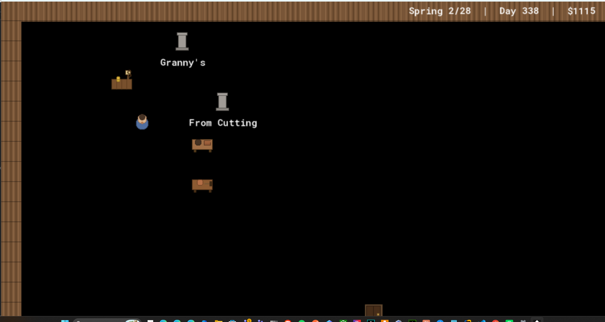
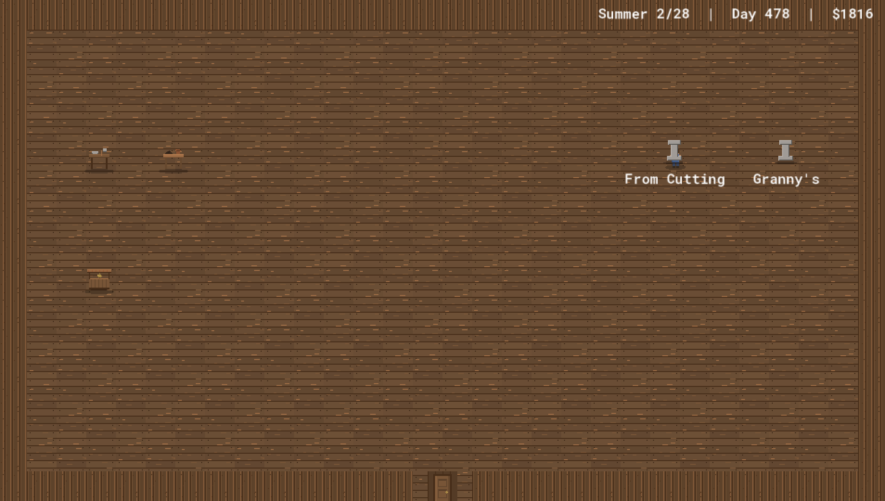
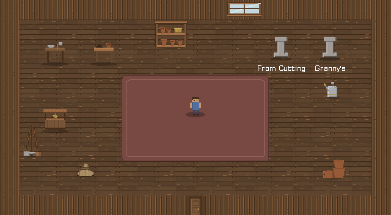

Here is a bug that only shows up on a computer that isn't mine: you open the game on a big monitor and it's a postage stamp in the corner. A small window, painted one-to-one, with the player a thumbnail stranded in acres of empty floor. On my machine, during development, it looked fine. On a 4K display it looked like a mistake.

The reason is that the game had no resolution layer at all. The room was some fixed pixel size, the window was that same size, and the screen was whatever the screen was. Three numbers that happened to agree on my desk and disagreed everywhere else. Fixing that is the boring-sounding work of "resolution independence," and it turned out to be two genuinely different problems wearing one coat: a *maths* problem (make the pixels fit any window) and a *design* problem (make the room feel right at the size you picked). This is about both.

## Step one: decide what a pixel is

The move that makes everything else possible is to stop thinking about the window and start thinking about a *logical canvas*. The game renders to a fixed internal resolution — I picked **960×540** — and that canvas gets scaled up to whatever the actual window is. 960×540 doubles cleanly to 1080p, which is the common case, and it's a comfortable amount of room for a cozy top-down game.

```gml
#macro GAME_WIDTH  960
#macro GAME_HEIGHT 540
```

Everything in the game logic now thinks in those units. A room is 960×540. The player is at some (x, y) inside that. The window can be 1920×1080 or 2560×1440 or letterboxed fullscreen on an ultrawide — the game doesn't know and doesn't care, because it draws to the canvas and the engine scales the canvas.

## The free win: the UI was already ready

The single most satisfying line in this whole effort:

```gml
display_set_gui_size(GAME_WIDTH, GAME_HEIGHT);
```

GameMaker has a separate "GUI layer" for HUD and menus, and you can fix its size independently of the window. Pin it to 960×540 and *every piece of UI in the game becomes resolution-independent for free*. Every panel, every button, every label is laid out in 960×540 coordinates and the engine handles the rest.

It was free because of a decision past-me made months ago without knowing it'd pay off here: all the UI already reads the mouse in GUI space via `device_mouse_x_to_gui`, not in window pixels. So a button that checks "is the cursor inside my rectangle" was already asking the question in the right coordinate system. A whole class of "the click is offset from the button on a different monitor" bug simply never existed, because the input and the layout were already speaking the same language. The best bugs are the ones a past decision quietly prevents.

## The problem nobody warns you about: the window won't fit either

So now the window is `GAME_WIDTH × scale`. At 2× that's 1920×1080. Sounds perfect — until you remember that a "1080p" monitor does not give you 1080 usable pixels. The taskbar eats some. The title bar eats some. Request a 1080-tall window on a 1080-tall display and the bottom of your game is *behind the taskbar*, off the bottom of the screen. And 3× (2880 tall) is just absurd on any normal monitor.



The fix is to never request a window bigger than the *usable* desktop, and to shrink uniformly when you have to so the aspect ratio holds:

```gml
var _fit = min(1, (display_get_width()  * 0.98) / _w,
                  (display_get_height() * 0.90) / _h);
_w = floor(_w * _fit);
_h = floor(_h * _fit);
```

This is the standard "contain" fit. `_fit` is the largest single factor that keeps the window inside the available space — and because it's *one* factor applied to both dimensions, the 16:9 ratio is preserved automatically. The `min(1, ...)` means we only ever shrink, never enlarge: if the requested size already fits, `_fit` is 1 and nothing happens. The fractional reserves — `0.98` on width, a more generous `0.90` on height — leave room for the chrome, and being fractions rather than fixed pixel counts, they hold up across different DPI settings where a hardcoded "minus 40 pixels" wouldn't. A 2× or 3× request on a 1080-tall screen now just quietly fills the available height instead of marching off the bottom.

Fullscreen, meanwhile, stays the crisp option: it letterboxes the 960×540 canvas to an exact integer multiple and centres it.

## Crispness, and the tradeoff you should say out loud

Pixel art wants **nearest-neighbour** scaling — no interpolation, no blur, hard edges. That's a project setting (`interpolate_pixels = false`), and with it on, a clean integer scale is perfect: 960×540 at exactly 2× is every source pixel becoming exactly four screen pixels. Crisp.

But the window-fit clamp above produces *non-integer* scales. If `_fit` works out to, say, 1.87×, then a single source pixel has to cover 1.87 screen pixels, which it can't, so some pixels are one screen-pixel wide and some are two. The image is sharp but *slightly uneven* — faint irregularity in the pixel grid. This is unavoidable: you cannot have both "fills an arbitrary window" and "every pixel is the same size" unless the window happens to be an integer multiple. Fullscreen gets you exact integers; windowed-and-clamped gets you fit-but-slightly-uneven. The right move isn't to pretend the tradeoff doesn't exist — it's to name it, default to crisp where you can (fullscreen), and accept the unevenness where fit matters more.

## The thing that broke: hotspots that drifted

Changing the resolution model broke something three rooms away: the 3D tree viewer. It projects 3D points (where a branch is) into 2D clickable hotspots, and that projection used the *window* dimensions to map onto the screen. Which used to be fine, because the window and the GUI were the same size. Now they're not — the window is 1920×1080, the GUI is 960×540 — so the hotspots projected to window coordinates and drifted off the branches they were supposed to sit on.

The fix is to project into GUI space, since that's where the hotspots are actually drawn:

```gml
// Map NDC to GUI space (the logical 960x540), not window pixels — hotspots
// are drawn in Draw GUI, and window size differs from GUI size once scaled.
return {
    x: (_ndc_x * 0.5 + 0.5) * display_get_gui_width(),
    y: (1 - (_ndc_y * 0.5 + 0.5)) * display_get_gui_height(),
};
```

This is a recurring shape: a coordinate-space assumption that was *invisibly true* (window == GUI) becomes false the moment you add a scaling layer, and everything that quietly relied on the coincidence has to be told which space it actually meant. (There's a whole `[Math]` post coming about this — the screen is a stack of coordinate systems, and most "it's in the wrong place" bugs are one transform applied in the wrong space.)

## Where it stopped being maths

Here's the pivot. I got the canvas fitting any window, the UI resolution-independent, the hotspots back on their branches — all the *maths* of resolution done — and the shed still looked wrong. It read like a **warehouse**. 960×540 of bare plank floor with a workbench marooned in the middle of it and a tiny person wandering across. Technically correct, emotionally empty.



The fix wasn't a resolution setting. It was *level design*. "Cozy" turned out to be a layout, not a number:

- **Inset the walls.** The wall ring doesn't fill the canvas — it sits well inside it, defining a small interior, with the dark room background framing it like matting around a picture.

  ```gml
  #macro SHED_X0 160
  #macro SHED_Y0 96
  #macro SHED_X1 768
  #macro SHED_Y1 416
  ```

  The floor is only tiled inside that ring; outside, the shadowed surround makes the room feel held rather than sprawling.
- **Lay a rug.** A dusty-red area rug in the centre gives the eye an anchor and the room a centre of gravity — the difference between "a space" and "a room someone uses."
- **Dim the floor a touch** so it recedes and the props and plants pop against it.
- **Scale the actors up.** The player and props draw at 1.5× so they have presence in the smaller interior instead of rattling around in it.



Same resolution. Same engine. The difference between the two screenshots above is entirely *where I put the walls and what I laid on the floor*. The maths made the game fit any screen; the design made it worth looking at on one.

## The shape of the lesson

"Resolution independence" sounds like one task and is really a sequence of distinct decisions, each defending the one before it: pick a logical canvas; render to it and scale; defend that scale against the desktop's actual usable size; defend the crispness tradeoff out loud; chase down every place that assumed window and canvas were the same; and *then*, with all the maths settled, ask the question the maths can't answer — does it feel like a place? The first five are arithmetic. The last one is a rug.

---

*Next, and last in this flood: the `[Math]` post that ties the art, the fonts, and this scaling work together under one idea — that everything you see on screen is a little stack of coordinate transforms, and every "why is it the wrong size / in the wrong place" bug is one transform in the wrong space.*
