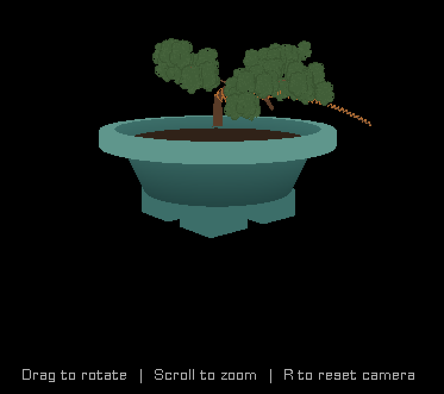
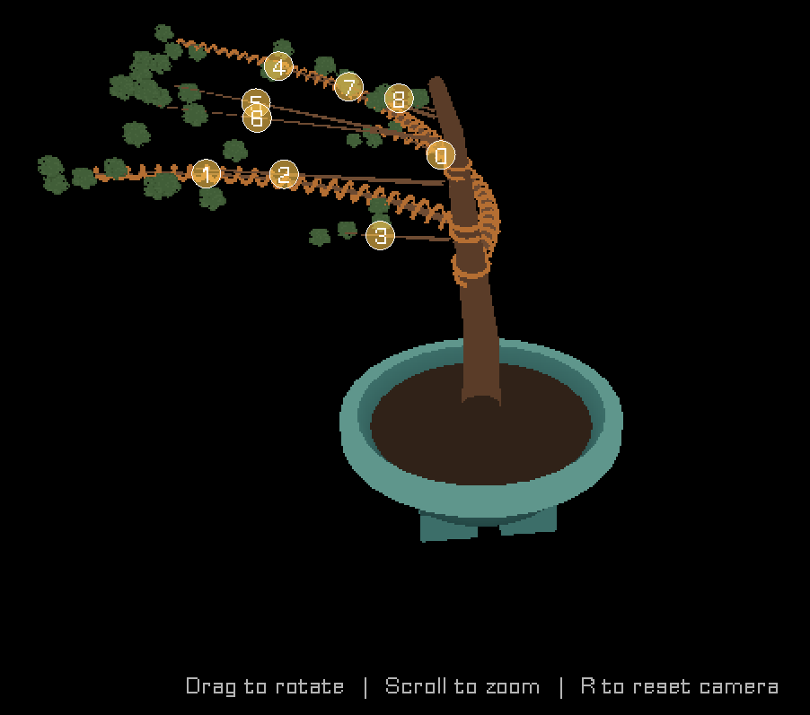

*Fifth-ish post in the math sub-series, and a deliberate change of pace. The earlier ones each drilled into one piece of geometry — a circle, a bent trunk, a curving branch, the stack of coordinate spaces. This one zooms out and does a walking tour instead: every kind of maths the 3D tree viewer runs on, one stop each, with a pointer to the deeper post each could become. Same audience as ever — if you're comfortable that `sin` and `cos` describe going round a circle, you're qualified. Think of this as the map you consult before the next few hikes.*



When you open a tree in the 3D viewer, you can orbit around it, zoom, and click on individual branches to wire or prune them. It feels like a little 3D program. And it is — but there's no game engine magic doing the 3D for me. It's a few hundred lines of GML, and almost all of the interesting part is arithmetic you met in school, doing a specific job. Here's the whole toolbox.

## Stop 1 — Trig: where the camera floats

You orbit the tree by dragging the mouse. Under that gesture is the oldest trick in 3D: **spherical coordinates.** The camera doesn't store an (x, y, z) position you nudge around. It stores three numbers — a yaw (angle around the tree), a pitch (angle above the ground), and a distance — and *computes* its position every frame:

```gml
var _cx = cam_target.x + dcos(cam_yaw) * dcos(cam_pitch) * cam_distance;
var _cy = cam_target.y - dsin(cam_yaw) * dcos(cam_pitch) * cam_distance;
var _cz = cam_target.z + dsin(cam_pitch) * cam_distance;
```

That's it — that's the orbit. `dcos`/`dsin` are just cosine and sine in degrees. Dragging left-right changes `cam_yaw`; dragging up-down changes `cam_pitch`; the scroll wheel changes `cam_distance`. The `dcos(cam_pitch)` factor on the horizontal terms is the part worth pausing on: as you tilt up toward straight-down, `cos(pitch)` shrinks toward zero, so the horizontal radius shrinks and the camera tucks in over the top of the tree, exactly like a real camera on a boom arm. Three angles in, a 3D position out. The same maths that puts a point on a circle, done twice (once for each angle), puts a camera on a sphere.

*Could become:* a post on spherical vs Cartesian coordinates and why games store orbit cameras as angles.

## Stop 2 — Vectors: everything is three numbers

Every position, direction, and axis in the viewer is a `vec3` — a struct of `{x, y, z}` — and there's a little library of operations on them:

```gml
vec3_add, vec3_sub, vec3_scale, vec3_length, vec3_normalize, vec3_cross, ...
```

None of these is fancy. `vec3_length` is Pythagoras in 3D (`sqrt(x² + y² + z²)`). `vec3_normalize` divides a vector by its own length so it still points the same way but is exactly 1 unit long — which matters constantly, because a lot of the formulas downstream only behave if their inputs are unit-length. The reason to have the library at all is that once "a direction" is a single value you can add, scale, and rotate, the geometry code starts reading like sentences instead of coordinate bookkeeping.

## Stop 3 — The dot product: how much do two arrows agree?

The dot product takes two vectors and returns a single number that measures how aligned they are: big and positive when they point the same way, zero when they're perpendicular, negative when opposed. It's one multiply-and-add: `a·b = aₓbₓ + a_yb_y + a_zb_z`.

You might think you'd see it spelled out all over the viewer. You mostly don't — because it's *hiding inside every matrix multiply.* When the code projects a 3D point to the screen, each line like

```gml
var _cx = _vp[0]*_x + _vp[4]*_y + _vp[8]*_z + _vp[12];
```

is literally the dot product of one row of the matrix with the point. A 4×4 matrix times a vector is just four dot products stacked up. So the dot product isn't a feature I call occasionally; it's the atom that matrices are built from.

*Could become:* a post on the dot product as "the projection operator" — shadows, lighting angles, and "is this in front of me?" all from one multiply-add.

## Stop 4 — The cross product: manufacturing a perpendicular

Where the dot product eats two vectors and gives a number, the **cross product** eats two vectors and gives a third vector — one that's perpendicular to both:

```gml
function vec3_cross(_a, _b) {
    return vec3(
        _a.y * _b.z - _a.z * _b.y,
        _a.z * _b.x - _a.x * _b.z,
        _a.x * _b.y - _a.y * _b.x
    );
}
```

This is how the viewer builds **frames** — little three-axis coordinate systems that ride along the trunk and branches. Given a branch's direction (the tangent) and one other reference direction, a cross product manufactures a vector pointing "sideways out of the branch," and a second cross product completes the set. Those three perpendicular axes are what let the wire coil wrap *around* a branch instead of skewering it, and what orient each foliage cluster. The camera's own orientation is built the same way: given "which way am I looking" and "which way is up," a cross product produces "which way is right." Manufacturing a perpendicular on demand is one of the most useful things you can do in 3D, and it's six multiplies.



*Could become:* the wire-coil post — local frames perpendicular to a branch, helix parametrisation, oriented rings.

## Stop 5 — Rotation: bending without breaking the frame

When you bend a trunk, the whole local frame has to rotate with it. The viewer does that with **Rodrigues' rotation formula** — rotate a vector around an arbitrary axis by an angle — which combines the dot product, the cross product, and trig into one expression:

```gml
function vec3_rotate(_v, _axis, _angle_deg) {
    // ... cos/sin of the angle, the axis·v dot, the axis×v cross, combined
}
```

The trunk-bending post took this one apart in full; here it's enough to note that "rotate this arrow around that axis" is a closed-form thing you can just *compute*, and that it's assembled from the two products we just met. Rotation isn't a primitive — it's dot and cross in a trenchcoat.

*Already a deeper post:* [How to Bend a Trunk](/bonsai/math-how-to-bend-a-trunk/).

## Stop 6 — Parametric curves: the tree's actual shape

The trunk and every branch are **parametric curves** — you feed in a parameter `t` from 0 (base) to 1 (tip) and get back a position. Sweep `t` from 0 to 1 and you've traced the whole curve; sample it at a dozen values and you've got the points to build a mesh from. The trunk's curve comes from walking a frame up through its bend events; a branch's comes from a closed-form circular arc. Two posts already live here, so I'll just wave at them.

*Already deeper posts:* [How to Bend a Trunk](/bonsai/math-how-to-bend-a-trunk/) and [How a Branch Learns to Curve](/bonsai/math-how-a-branch-learns-to-curve/).

## Stop 7 — Interpolation: filling in between samples

A small but constant one. The trunk is only sampled at a handful of heights, but the code often needs a frame at some in-between height — where a branch attaches, say. So it **lerps**: linearly blends the two nearest samples, then renormalises the result back to unit length. Linear interpolation (`lerp(a, b, t) = a + (b - a)·t`) is the humblest formula in the whole viewer and possibly the most-used — any time you want "partway between these two things," it's the answer.

## Stop 8 — Projection matrices: 3D down to a flat screen

The big one, and the reason all the others exist: turning a 3D tree into 2D pixels. Two matrices do the heavy lifting, both built by one engine call each:

```gml
var _view = matrix_build_lookat(_cx, _cy, _cz,  cam_target.x, cam_target.y, cam_target.z,  0, 0, -1);
var _proj = matrix_build_projection_perspective_fov(60, -_aspect, 0.01, 20);
```

The **view** matrix moves the whole world so the camera sits at the origin looking down an axis (built from that camera position trig in Stop 1, plus an up-vector and a cross product or two). The **projection** matrix applies perspective — the reason far things look small. Multiply a 3D point by both, do the "perspective divide" (divide by the w component), and you land in a tidy cube of normalised coordinates that maps straight to the screen. The coordinate-systems post walked this pipeline end to end, so here it's just the headline: *every visible vertex of the tree is one point pushed through these two matrices.*

There's one oddity in those two lines that I keep flagging and not fully explaining: the up-vector is `(0, 0, -1)` and the aspect ratio is *negated*. That's because this game treats **z as up** — trees grow in z — inside an engine whose screen-y points *down*, and reconciling those two conventions costs exactly those two sign flips. Get them wrong and the tree renders upside down (ask me how I know). That handedness story is its own rabbit hole.

*Could become:* the deep cut on z-up-in-a-y-down-world — projection sign flips, lookat conventions, and why the engine's own 3D tutorials get it subtly wrong for anything past a toy scene.

## The map, folded up

That's the whole toolbox: trig to place the camera, vectors to hold everything, the dot product hiding inside the matrices, the cross product manufacturing perpendiculars, Rodrigues to rotate, parametric curves for the tree's shape, lerp to fill the gaps, and projection matrices to flatten it all onto your screen. Not one piece of it is beyond a keen high-schooler. The "3D" feeling is what emerges when you wire these humble parts together and point a camera at the result.

Which is, I think, the quietly reassuring thing about graphics maths: it's not a separate magical discipline. It's the arithmetic you already know, applied with enough care and in the right order that a tree appears and you can walk around it.

---

## Coming next

Now that the map's laid out, the next post takes the first deeper hike on it: *where does branch 3 actually start?* — the trunk-attachment maths. A branch's base is computed in the trunk's *own* local frame (the one from Stop 4), so it stays glued to the right spot on the bark even when the trunk leans or bends. It's the bridge between "a circle in the abstract" and "a circle as the cross-section of a real, tilting game object" — and the piece I've now skipped over in two separate posts. Time to stop skipping it.
