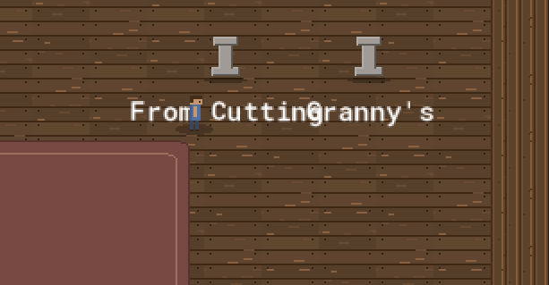
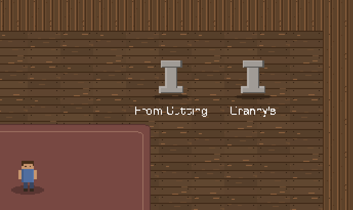

The day I added resolution independence, the game started yelling at me.

Not literally. But every label — every button, every panel title, every little "(empty)" under a pedestal — was suddenly *enormous*. The default GameMaker font, blown up to something like 24 pixels tall on screen, looming over a world I'd just spent an afternoon making cozy and small. The art said "quiet greenhouse"; the text said **HARDWARE STORE SIGNAGE**.



This is a post about fixing that, and about how the fix did *nothing* — twice, for two completely different reasons. Both reasons taught me something about what a game engine's drawing state actually promises you, which is less than you'd think.

## Mistake zero: the font was just the default

The loudness itself wasn't a bug, exactly. I'd never *chosen* a font, so the game used GameMaker's built-in one, and the built-in one is sized for a 1:1 world. Once everything got scaled up from the 960×540 logical canvas, the default font scaled up too, and it has no idea it's supposed to be unobtrusive. So: make a font.

I made `fnt_main` — **Square721 BT, size 9, bold, anti-aliasing off**. Size 9 because at the magnification the game runs at, 9 logical pixels is a comfortable reading size, not a billboard. AA off because this is a pixel-art game and soft-edged text floating over hard-edged sprites looks like a ransom note. Then I wired it up at boot — `draw_set_font(fnt_main)` in the game controller's setup, once, globally, the way you'd set a default.

I ran it. **Nothing changed.** Every label was still the giant default font.

## Mistake one: "set it once" is a lie

My wiring looked correct. There was the line, `draw_set_font(fnt_main)`, sitting in the controller's create code, executing on boot. I could put a breakpoint on it. It ran. And the text ignored it completely.

Here's the trap, and it's a good one: **`draw_set_font` does not reliably persist across draw events.** It's not a property you set on the game; it's a piece of *transient render state* that's true for the current drawing pass and is liable to reset between events, between instances, and between the Draw and Draw-GUI passes. Setting it once in one object's create event and expecting every other object's draw to inherit it is like setting the oven temperature in your kitchen and expecting your neighbour's oven to preheat. Each draw event starts from a clean-ish slate. If a panel's Draw event doesn't *itself* say "use this font," it draws in whatever the default is.

"Set the global default once at startup" is a mental model the engine quietly lets you believe and then doesn't honour. The text wasn't ignoring my font — it never saw it. By the time each label drew, the state I'd set three events ago was gone.

The fix is to set the font at the top of *every* event that draws text. That sounds like a maintenance nightmare — fifteen-odd modal panels, the HUD, the world labels, the 3D viewer's toolbar, the title screen, all needing the same line. But it collapses beautifully, because the UI was already built on a parent object. Every modal panel inherits from `obj_ui_panel`, and they all draw their chrome and content through its one Draw-GUI event. So *one* line, in *one* place, covers every dialog in the game:

```gml
// obj_ui_panel — Draw GUI event
// Set the UI font here so every panel (chrome + draw_content) uses it — draw
// font state isn't reliably carried between events/passes.
draw_set_font(fnt_main);
```

That comment is a little note-to-self, written in the moment, so the next person (me, in a month) doesn't "tidy up" that line thinking it's redundant. It is the opposite of redundant. It is the line that makes fifteen panels legible.

The non-panel text — the HUD, the pedestal labels, the viewer toolbar, the title — each got its own `draw_set_font(fnt_main)` at the top of its draw. A handful of lines. And *then* the game spoke at a normal volume.

The lesson isn't "GameMaker is weird here" (though it is). It's the general one: **know exactly what your engine's global render state guarantees, and assume it guarantees nothing across boundaries.** Font, colour, alpha, halign — these are all the same kind of transient state, and the bugs they cause all present identically: "I set the thing, the thing did not happen." When a setter seems to do nothing, the first question is "does this value survive to the moment it's used, or does something reset it in between?"

## Mistake two: the same feature, broken a different way

With the font working, one detail still nagged. The world-space labels — the little names floating under each tree and pedestal, "From Cutting," "Granny's" — were a touch too big relative to the tiny world sprites. Just the world ones; the UI was fine. So I reached for the obvious tool: draw those specific labels *scaled down*.

```gml
draw_text_transformed(x, y, "From Cutting", 0.8, 0.8, 0);   // 80% size
```

It mangled them. Not "made them small" — *mangled*. "From Cutting" came back as a smear of broken pixels, letters fused together, some strokes missing entirely, like text that had been faxed twice. It was unreadable in a way that was almost impressive.



The reason is the same family of lesson as before, applied to a different invariant. `fnt_main` is a **bitmap font**: it's not math, it's a little texture atlas of pre-rendered glyphs, each glyph a fixed grid of pixels. Drawing it at its native size maps each glyph-pixel to a screen-pixel cleanly. Drawing it at **0.8×** asks the engine to squeeze, say, a 9-pixel-tall glyph into 7.2 pixels — and since you can't have 0.2 of a pixel, it has to drop and merge rows. With anti-aliasing *off*, there are no soft in-between pixels to cushion the loss, so the dropped rows just vanish and adjacent letters collide. Sub-pixel scaling and hard-edged bitmap text are fundamentally incompatible. The transform was doing exactly what I asked; what I asked was nonsense.

The fix was to stop asking. I reverted to plain `draw_text` at native size everywhere — `draw_text_transformed` is now entirely gone from the game. If the world labels are ever genuinely too big, the lever is the font's *size* (make a 7px variant, or use a smaller font for world labels), **not** a draw-time scale. You change the resolution the glyphs are *baked at*, not the resolution they're *stretched to*. The number that's allowed to move is the one that produces fresh crisp pixels, not the one that resamples stale ones.

## The aside that explains a whole house rule

There's a number in `fnt_main`'s definition that quietly governs a rule I follow everywhere in this game. The font defines glyphs for character codes **32 through 127** — plain ASCII — and exactly one more: code 9647, which is `▯`, the little box that means *"I don't have this character."*

That's it. No curly quotes. No em-dash. No accented letters. So the moment any drawn string contains a character outside ASCII — a tidy `—` instead of ` - `, a "smart" apostrophe pasted from somewhere — it renders as that box, or as nothing. Which is why every piece of in-game text is deliberately, boringly ASCII: hyphens not em-dashes, straight quotes not curly. (This blog post is allowed its em-dashes; it's rendered by your browser, not by `fnt_main`.) The font's character range *is* the style guide. The constraint isn't a preference; it's the literal contents of a texture atlas.

## Two failures, one shape

Both mistakes were the same mistake at heart, and it's a humbling one because it's so basic: I assumed a piece of state was more durable, or more flexible, than it actually was. The font setting wasn't durable across events. The bitmap glyphs weren't flexible across scales. Both times the symptom was "my change had no effect / a broken effect," and both times the real question wasn't *what did I type wrong* but *what did I assume the engine would hold steady that it doesn't*.

The game speaks quietly now. Size 9, set explicitly in every mouth it speaks from, never stretched. It took two wrong turns to get there, which feels about right for a feature whose entire job was to be unnoticeable.

---

*That closes the look-and-feel flood — art, scaling, coordinate systems, and now fonts, all from the day the prototype stopped looking like a prototype. Next the blog goes back to the `[Math]` series, with the checkpoint post that's overdue: a walking tour of every kind of maths the 3D viewer runs on.*
